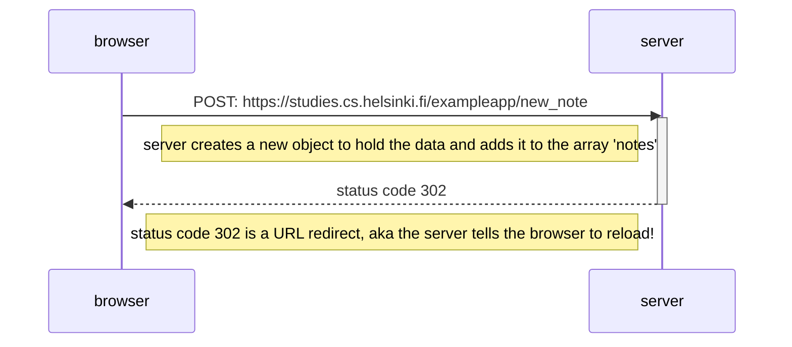

```mermaid
  sequenceDiagram
    participant browser
    participant server

    browser ->> server: POST: https://studies.cs.helsinki.fi/exampleapp/new_note
    activate server
    Note left of server:  server creates a new object to hold the data and adds it to the array 'notes'
    server -->> browser: status code 302
    deactivate server
    Note left of server:  status code 302 is a URL redirect, aka the server tells the browser to reload!

```

  
    
