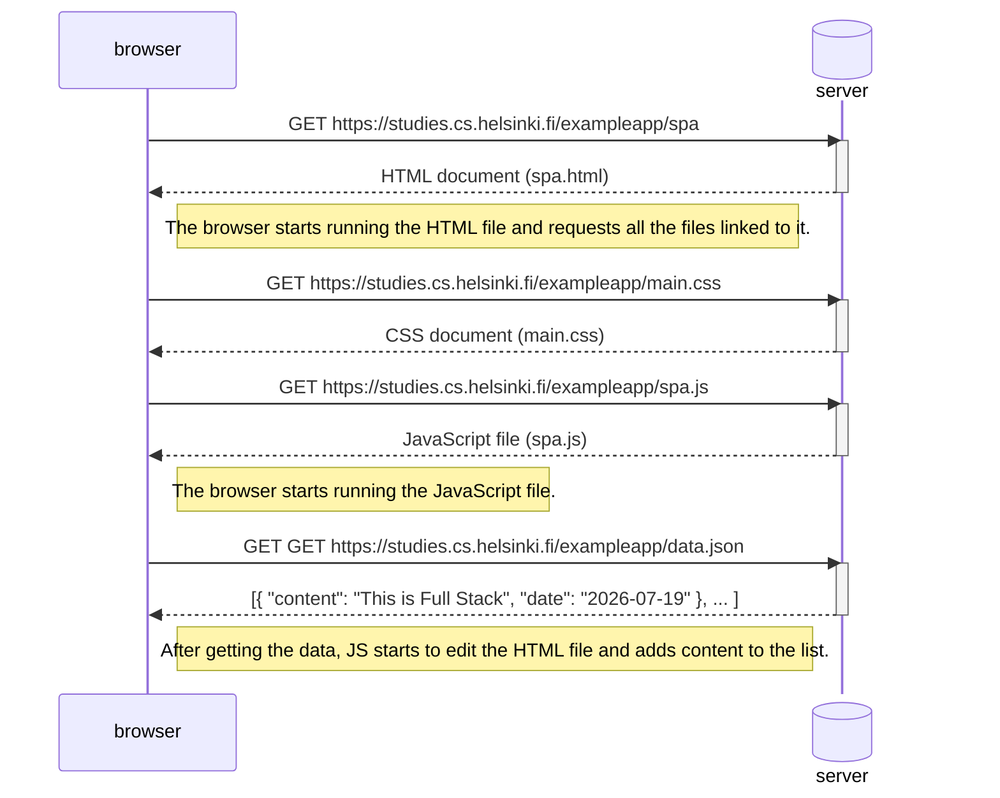

```mermaid
  sequenceDiagram
  participant b as browser
  participant s@{type: "database"} as server

  b ->> s: GET https://studies.cs.helsinki.fi/exampleapp/spa
  activate s
  s -->> b: HTML document (spa.html) 
  deactivate s
  Note right of b: The browser starts running the HTML file and requests all the files linked to it.

  b ->> s: GET https://studies.cs.helsinki.fi/exampleapp/main.css
  activate s
  s -->> b: CSS document (main.css) 
  deactivate s

  b ->> s: GET https://studies.cs.helsinki.fi/exampleapp/spa.js
  activate s
  s -->> b: JavaScript file (spa.js) 
  deactivate s
  Note right of b: The browser starts running the JavaScript file.

  b ->> s: GET GET https://studies.cs.helsinki.fi/exampleapp/data.json
  activate s
  s -->> b: [{ "content": "This is Full Stack", "date": "2026-07-19" }, ... ]
  deactivate s
  Note right of b: After getting the data, JS starts to edit the HTML file and adds content to the list.
```
