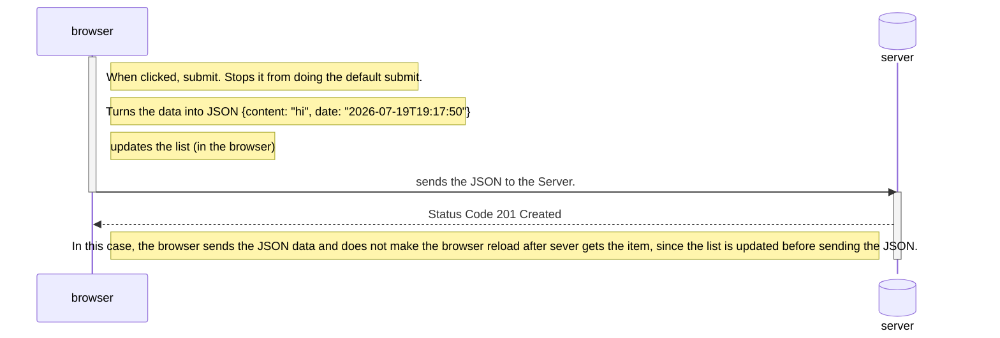

```mermaid
  sequenceDiagram
  participant b as browser
  participant s@{type: "database"} as server

  activate b
  Note right of b: When clicked, submit. Stops it from doing the default submit.
  Note right of b: Turns the data into JSON {content: "hi", date: "2026-07-19T19:17:50"}
  Note right of b: updates the list (in the browser)
  b->>s: sends the JSON to the Server.
deactivate b
activate s
  s-->>b: Status Code 201 Created
  note left of s: In this case, the browser sends the JSON data and does not make the browser reload after sever gets the item, since the list is updated before sending the JSON.
deactivate s

```
